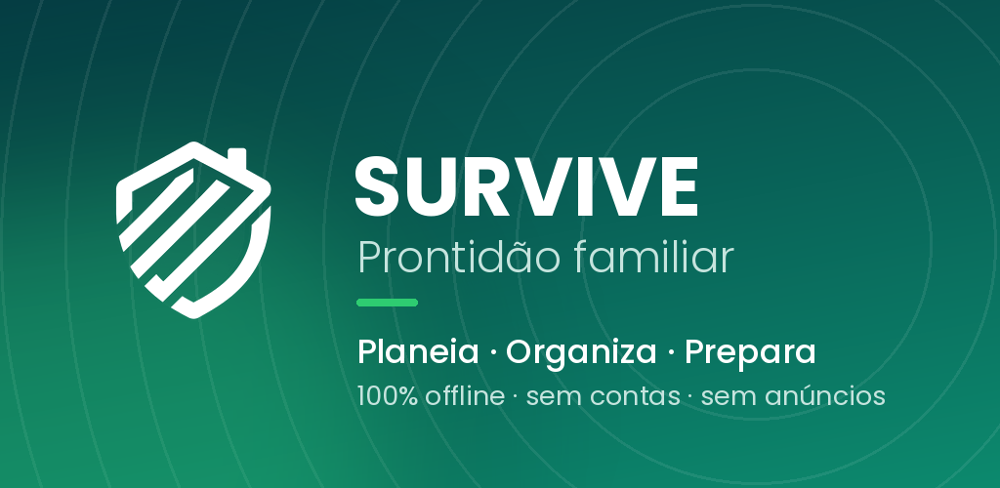
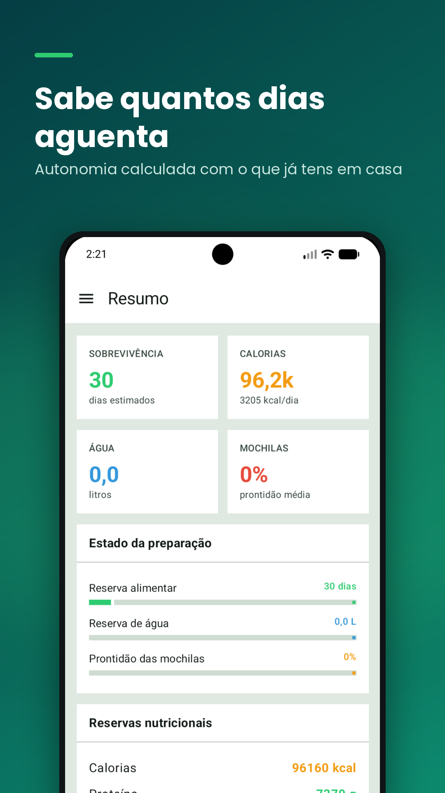
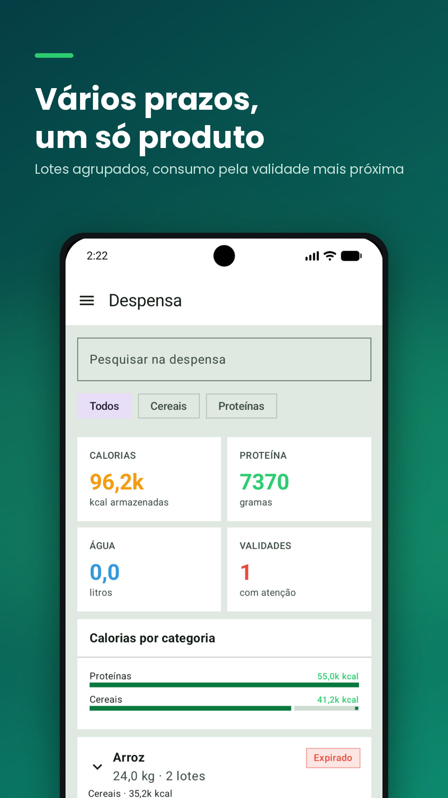
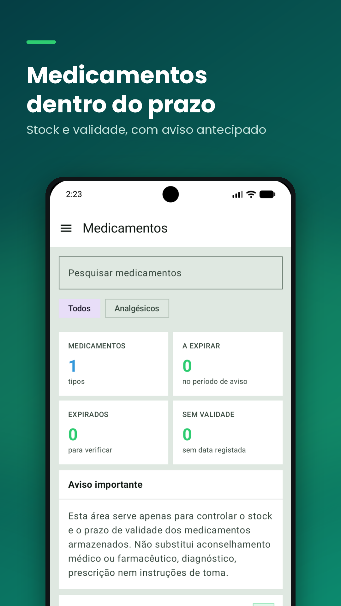
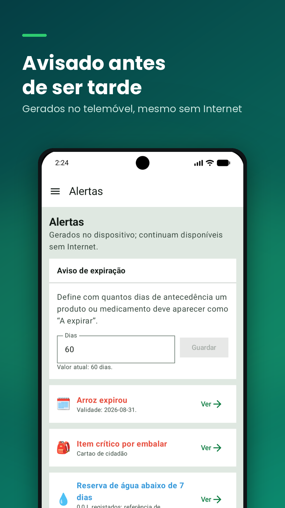

  

  <strong>Plan. Organise. Prepare.</strong> 
  A native Android app for organising family readiness, privately and completely offline.

  <a href="README.md">Português</a> · <a href="README.en.md">English</a>

# SURVIVE: Family Readiness

SURVIVE brings pantry supplies, stored medicines, emergency go-bags, household planning and expiry alerts together in one place. It is designed to remain available without an internet connection and to keep user data on the device.

> **Project status:** version **1.0**, being prepared for closed testing on Google Play.

## Features

- **Readiness overview:** estimates for food autonomy, available water, go-bag readiness and active alerts.
- **Pantry products and batches:** quantities, categories, purchase and expiry dates, nutrition and notes.
- **Expiry-based stock rotation:** equivalent batches are grouped and the earliest-expiring stock can be used first.
- **Nutrition calculations:** calories are calculated from protein, carbohydrates and fat, with total reserves.
- **Usage history:** view recent or complete consumption records and clear the history after confirmation.
- **Stored medicines:** stock and expiry tracking by batch, with dedicated categories and units.
- **Emergency go-bags:** multiple bags, household assignments, reorderable categories, priorities and checklists.
- **Household planning:** indicative daily-needs estimates and emergency-rationing scenarios.
- **Local alerts:** configurable warning period for products and medicines approaching expiry.
- **Personalisation:** light, dark and system themes, with Portuguese and English interfaces.
- **Backups:** manual JSON export and restore through Android's file picker.

## Screenshots

<table>
  <tr>
    <td align="center"> <strong>Overview</strong></td>
    <td align="center"> <strong>Pantry</strong></td>
    <td align="center"> <strong>Medicines</strong></td>
    <td align="center"> <strong>Alerts</strong></td>
  </tr>
</table>

## Privacy by design

SURVIVE runs entirely on the device:

- it has no Internet permission;
- it uses no online accounts, advertising or analytics;
- it does not send personal, household or medicine data to the developer or third parties;
- its database remains in the app's private storage;
- users control data export and deletion;
- medicine notifications do not reveal medicine names on the lock screen.

The password restricts access through the app interface, but the local database is not encrypted by the password. JSON backups are not encrypted either and should be kept in a private location.

Read the [Privacy Policy in English](https://nunchuckcoder.github.io/survive/en/), the [Portuguese version](https://nunchuckcoder.github.io/survive/), the [Support page](https://nunchuckcoder.github.io/survive/support/) and the [data deletion instructions](https://nunchuckcoder.github.io/survive/delete-data/).

## Important notices

### Medicines

The **Medicines** area is limited to tracking the stock and expiry dates of stored medicines. It does not provide medical or pharmaceutical advice, diagnosis, prescriptions, dosage guidance, instructions or medication-taking reminders. SURVIVE is not a medical device.

### Nutrition and readiness

Nutrition, autonomy and rationing estimates are intended only for general planning. They are not clinical or nutritional prescriptions and do not guarantee safety or survival. Children, pregnancy, illness, special needs and animals require appropriate professional assessment. In an emergency, follow the instructions of the relevant authorities.

## Technology

- Kotlin
- Jetpack Compose and Material 3
- Room
- DataStore
- Coroutines and Flow
- PBKDF2-HMAC-SHA-256 for local password derivation
- Android 8.0 or later (`minSdk 26`)
- `targetSdk 36`, `compileSdk 37` and JDK 17

## Languages

- Portuguese (Portugal), used as the fallback when the system language is unsupported
- English

User-entered content — including names, products, categories and notes — is never translated or changed by the interface.

## Version

- Public version: **1.0**
- `versionCode`: **1**
- Room database version: internal and independent of the public app version

The `versionCode` must increase for future Google Play uploads, even if the public version name temporarily remains 1.0.

## Contact

Developed by **Osvaldo Cipriano — NunchuckCoder**.

For support or privacy questions: [osvaldo@osvaldocipriano.dev](mailto:osvaldo@osvaldocipriano.dev)

---

SURVIVE is an independent app and does not represent any government body, emergency service or medical organisation.
